# Binary and binomial outcomes

For binary and binomial outcomes, raw residuals take only a small number of
values. Randomized quantile residuals use the fitted binomial CDF interval and a
uniform variate inside that interval, so the diagnostic can be read on an
approximately normal scale.

## Why Pearson and deviance residuals can be hard to read

The first binary example is intentionally simple. It shows why a reasonable
Bernoulli model can still produce awkward Pearson and deviance residual plots:
the outcome has only two possible values, so residuals tied directly to the raw
response often form branches or bands.

```stata
glm y x, family(binomial) link(logit)
predict double pearson_bin, pearson
predict double deviance_bin, deviance
qresid rq_binary, uvar(v)

qnorm pearson_bin
qnorm deviance_bin
qnorm rq_binary
```

[Stata output excerpt](assets/output/binary_residual_comparison_output.txt)

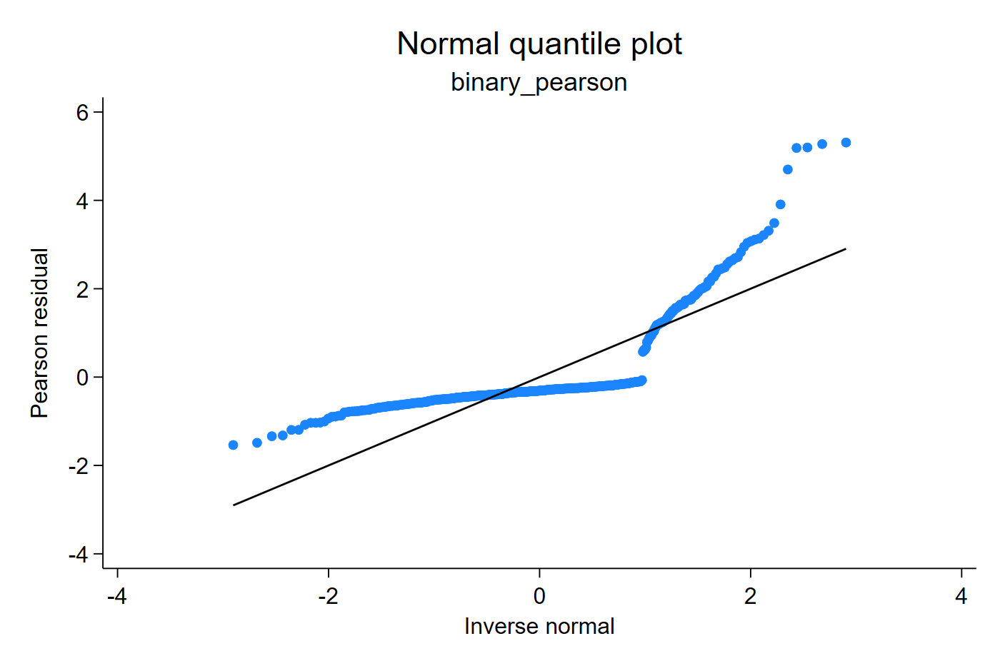

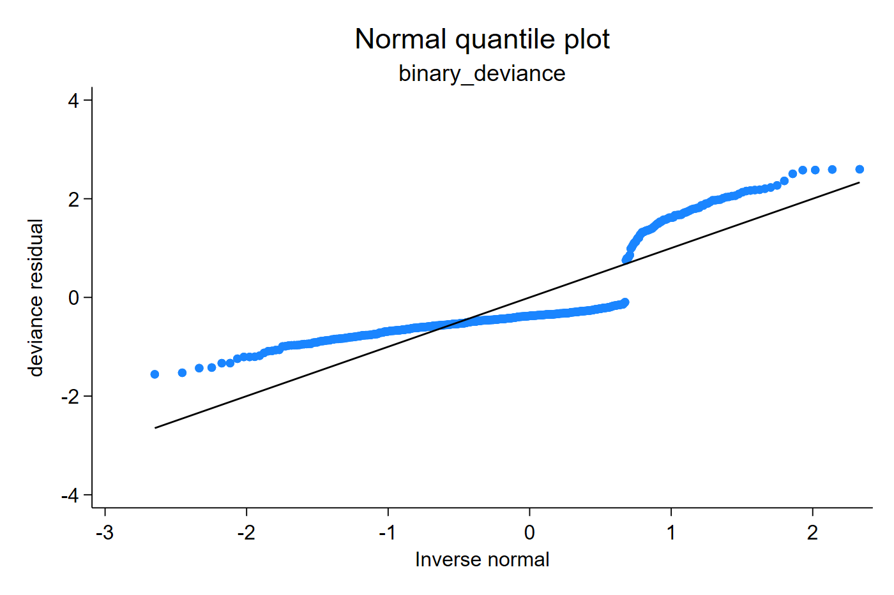


Pearson and deviance residuals are tied to the two-point Bernoulli support, so
their Q-Q plots can form separated curves even when the model is not badly
misspecified. The quantile residual uses the fitted Bernoulli probabilities and
randomizes inside each CDF jump; the resulting normal-scale plot is easier to
read as a distributional diagnostic.

Residual-versus-covariate plots tell the same story. A systematic trend would
suggest a problem with the fitted probability curve, but the Pearson scale is
dominated by the binary outcome support. The quantile residual plot is usually
closer to the familiar regression diagnostic: look for random scatter around
zero, not a smooth curve or an asymmetric band.

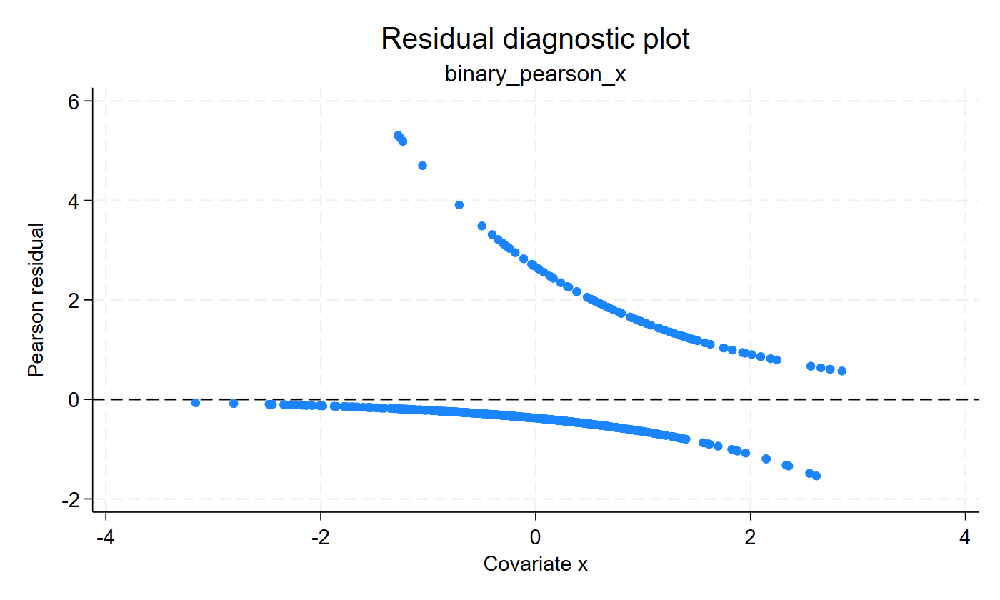

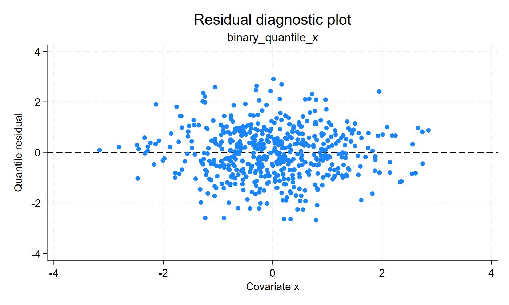

Take-home message: for Bernoulli data, quantile residuals do not make the
outcome continuous; they make the fitted Bernoulli CDF visible on a normal
diagnostic scale.

## Detecting nonlinear risk

The next example uses a binary outcome generated by a U-shaped risk curve. A
linear logit model forces risk to move monotonically with `x`, while the
quadratic model can represent a lower-risk middle and higher-risk extremes.
The coefficient table can tell us that a term matters, but the residual plot
shows the shape of the remaining lack of fit.

```stata
glm y x, family(binomial) link(logit)
predict double pearson_lin, pearson
predict double deviance_lin, deviance
qresid rq_logit_linear, uvar(v)

generate double x2 = x^2
glm y x x2, family(binomial) link(logit)
qresid rq_logit_quadratic, uvar(v)
```

[Stata output excerpt](assets/output/binary_nonlinearity_output.txt)

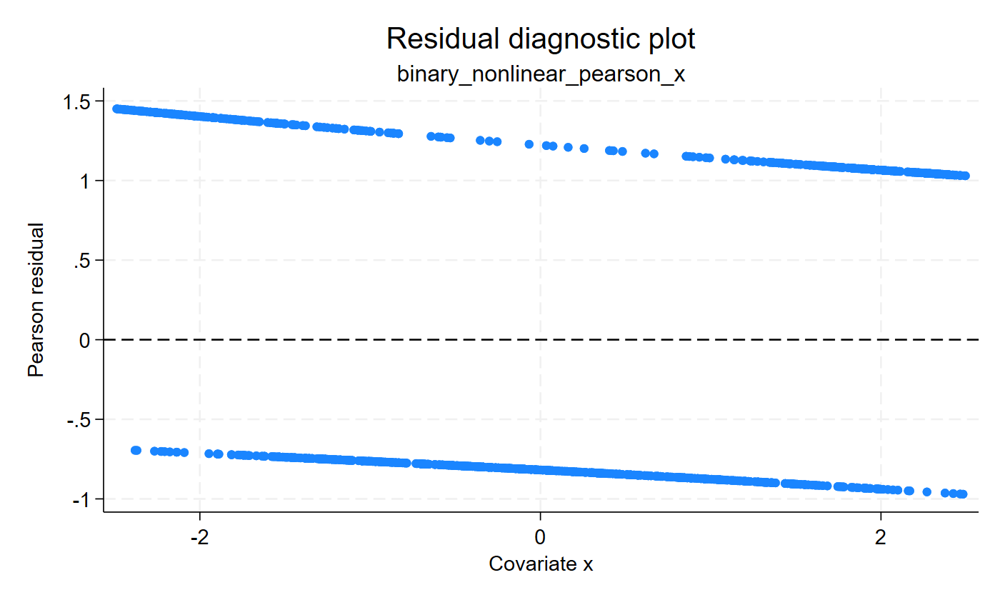

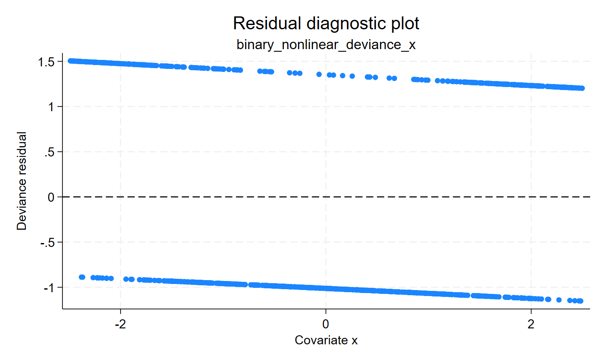

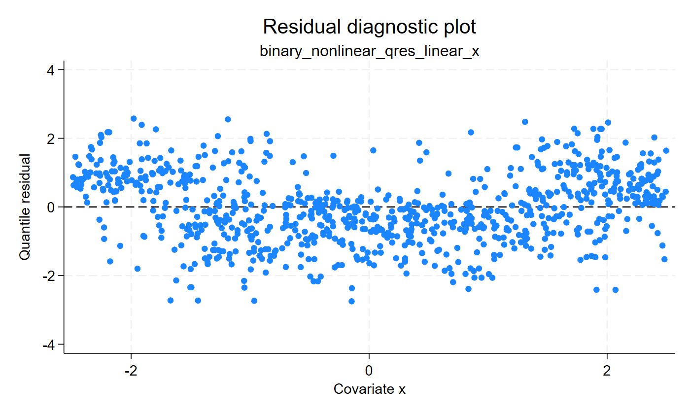

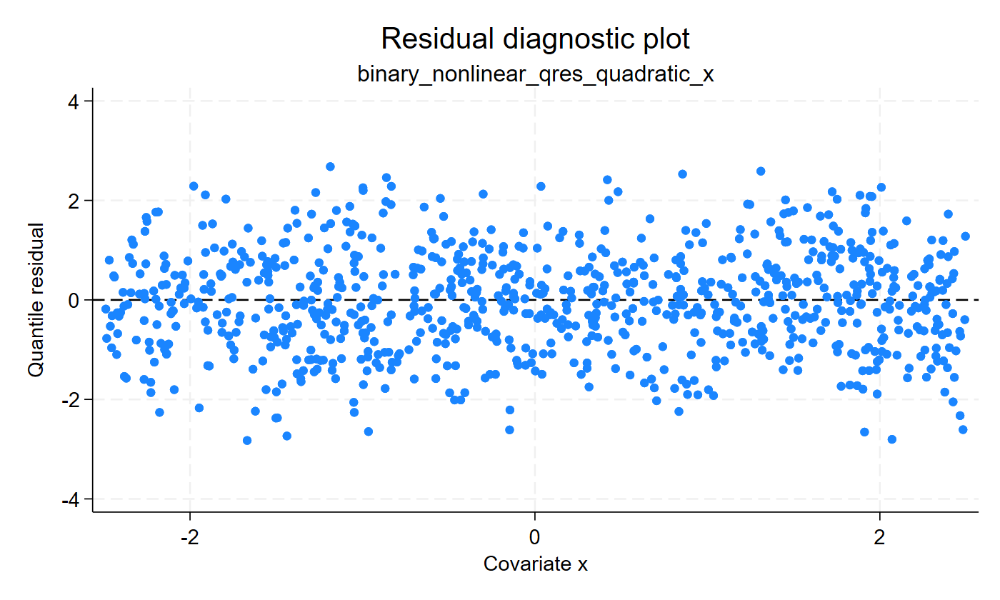

The Pearson and deviance plots are still dominated by bands from the binary
outcome, so the fitted and misspecified cases can look frustratingly similar.
The quantile residuals are easier to read directly: under the linear logit
model the residual cloud bends with the omitted U-shaped risk curve; after
adding the quadratic term, the cloud is more balanced around zero.

Take-home message: for binary data, quantile residuals can make functional-form
problems easier to see without pretending that the outcome is continuous.

## Binomial-count link comparison

Here the same binomial-count data are fitted with two links. Link choice is a
statement about how risk changes over the covariate range. With only a few
possible response values, Pearson and deviance residuals form bands that are
hard to interpret. Quantile residuals let that choice be checked on a fitted
CDF scale rather than only through coefficient significance.

```stata
glm y x, family(binomial trials) link(loglog)
qresid rq_bin_loglog, uvar(v)

glm y x, family(binomial trials) link(cloglog)
qresid rq_bin_cloglog, uvar(v)
qnorm rq_bin_cloglog
scatter rq_bin_cloglog x, yline(0)
```

[Stata output excerpt](assets/output/binary_links_output.txt)

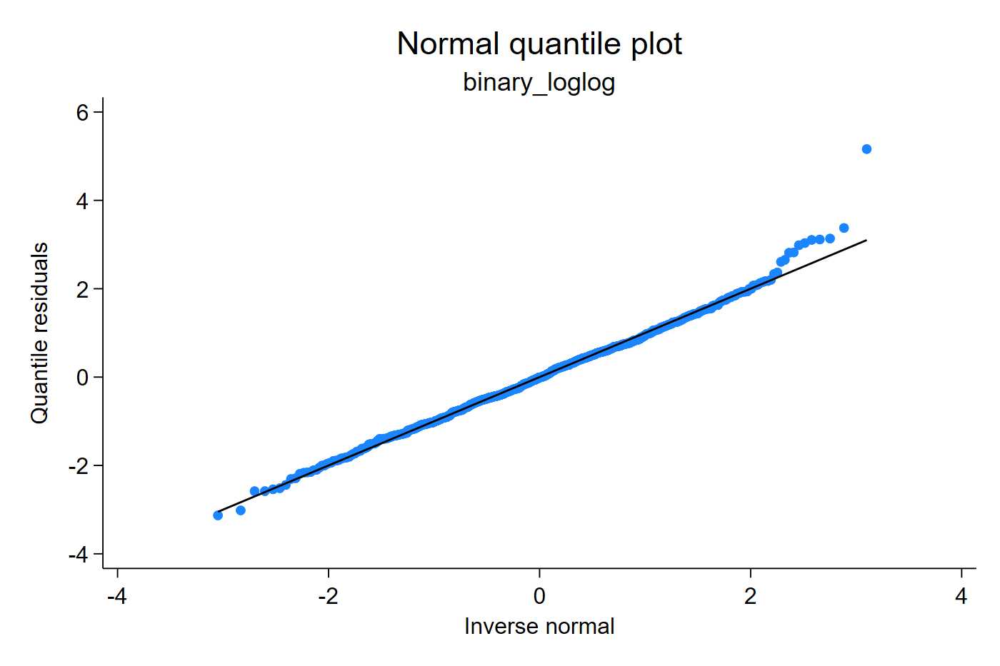

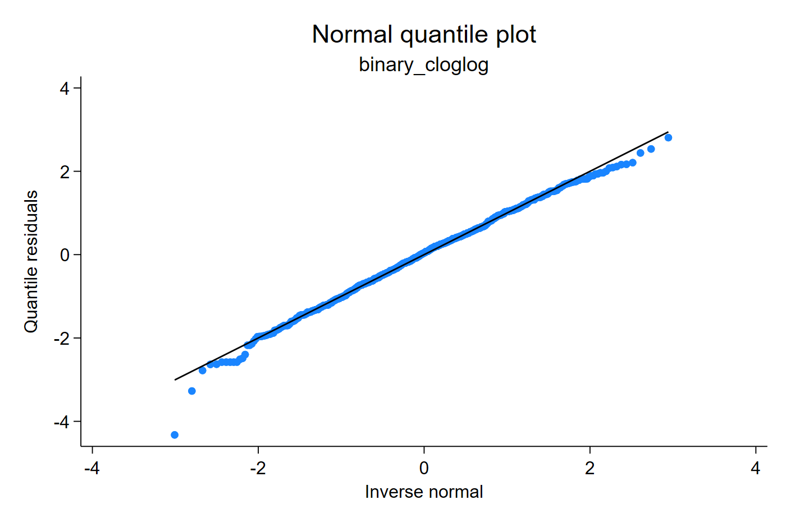

The two fits can have similar coefficient significance, but the residual
diagnostic asks a different question: does the fitted binomial distribution
place the observations on a coherent PIT scale? The residual-versus-covariate
plot is useful for link and functional-form checks because a systematic pattern
over `x` suggests that the fitted probability changes incorrectly over the
covariate range.

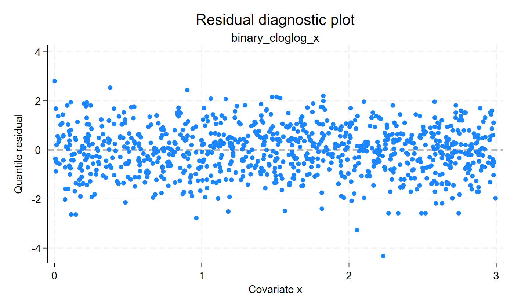

Take-home message: link choice is not only a coefficient table question. A
link that better describes how risk changes over a covariate range should also
produce a residual plot with less systematic structure.

## Binomial counts with trials

Binomial counts with trials are common in epidemiology and laboratory work:
each row records successes out of a known number of attempts or persons at
risk. The fitted CDF is binomial with row-specific trial totals, so the
diagnostic is not the same as a Poisson count check.

```stata
glm y x, family(binomial trials) link(logit)
qresid rq_bincount, uvar(v)
qnorm rq_bincount
predict double phat_bincount, mu
scatter rq_bincount phat_bincount, yline(0)
```

[Stata output excerpt](assets/output/binomial_counts_output.txt)

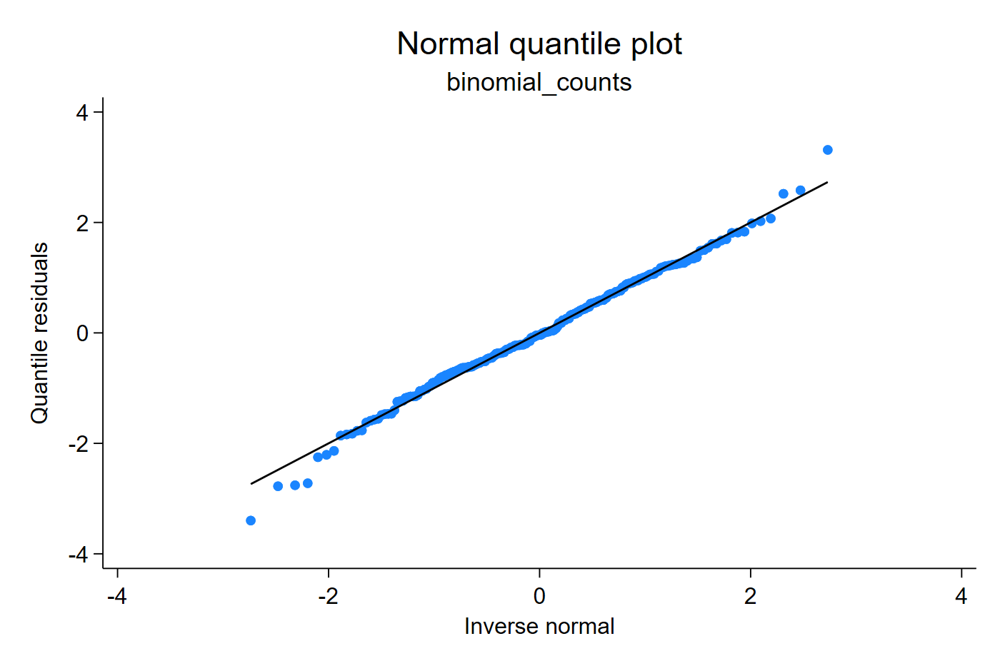

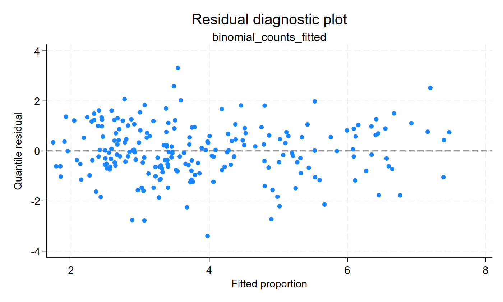

The fitted CDF is binomial with row-specific trial totals. The graph should be
read as a check of the binomial distribution, the link, and the covariate
structure together.
