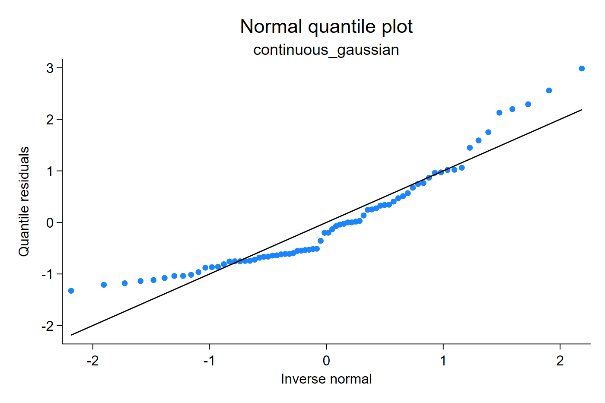
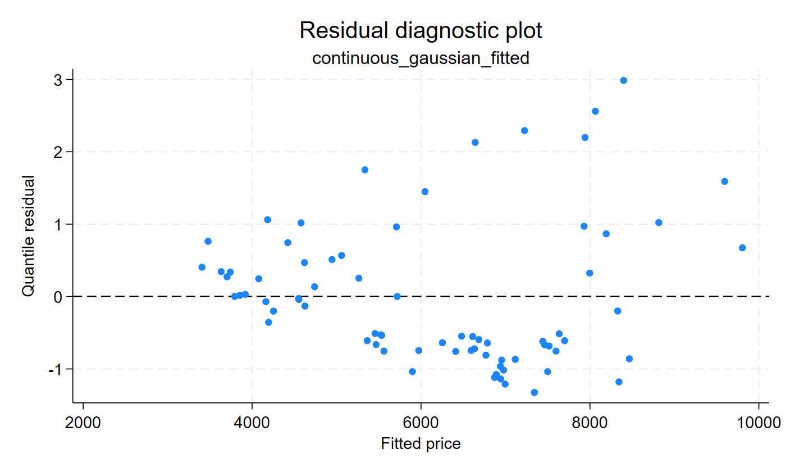
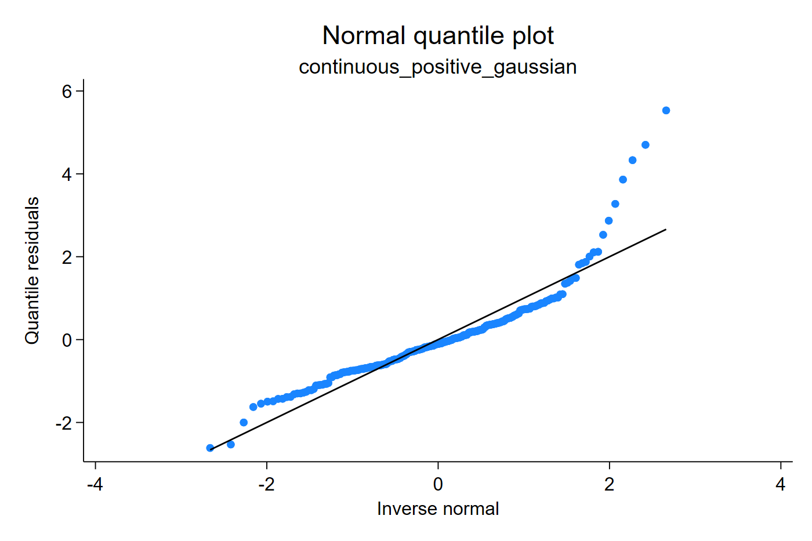
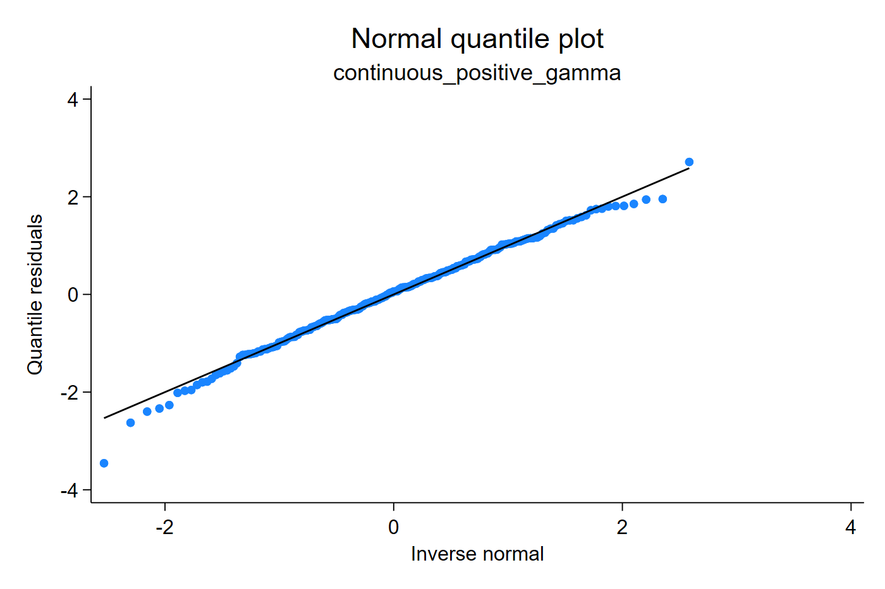
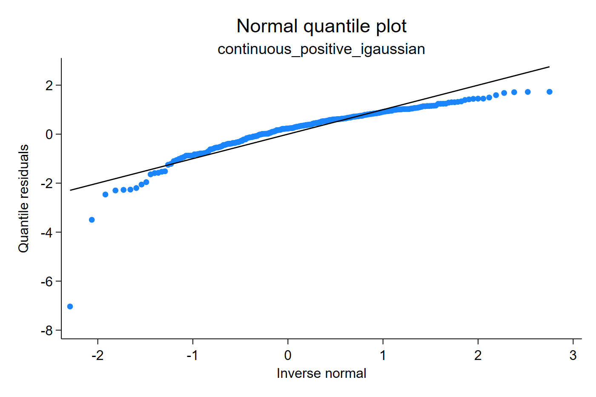
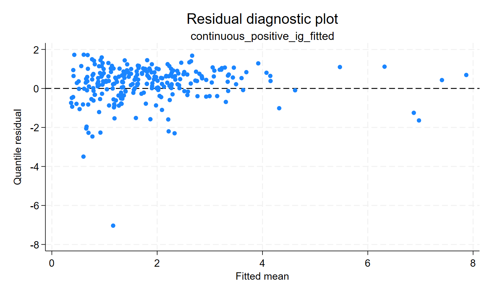

# Continuous outcomes

Quantile residuals put continuous models on a common normal scale. For an
ordinary Gaussian regression this often reproduces familiar residual
diagnostics. For positive, right-skewed outcomes, the same plots can make the
choice between a Gaussian, Gamma, or inverse-Gaussian fitted distribution more
transparent.

## Gaussian regression

The Gaussian example is the reference case. Here `qresid` should feel familiar:
after an ordinary linear regression, the quantile residual is on the same
normal diagnostic scale that applied users already know from regression
checking.

```stata
sysuse auto, clear
regress price mpg weight
qresid rq_gauss
qnorm rq_gauss
predict double fit_gauss, xb
scatter rq_gauss fit_gauss, yline(0)
```

[Stata output excerpt](assets/output/continuous_gaussian_output.txt)





The Q-Q plot is close to the usual regression-residual story: most points lie
near the reference line, with the largest positive residuals marking cars whose
prices are high relative to the linear fit. The residual-versus-fitted plot is
used to look for mean-structure or variance patterns, not only tail behavior.

## Positive asymmetric outcome

Positive biological and cost outcomes are often right-skewed. The next example
simulates a positive response and fits Gaussian, Gamma, and inverse-Gaussian
specifications. The fitted means can all look plausible in a coefficient table,
but the residual CDF check asks whether the whole fitted distribution is
credible.

```stata
regress y x
qresid rq_pos_gauss

glm y x, family(gamma) link(log)
qresid rq_pos_gamma

glm y x, family(igaussian) link(log)
qresid rq_pos_ig
```

[Stata output excerpt](assets/output/continuous_positive_output.txt)







The Gaussian residuals bend strongly in the upper tail because the model puts
mass on an inappropriate symmetric scale. The Gamma model is much closer to the
normal reference line for these data. The inverse-Gaussian fit is also on the
right support, but the residual-versus-fitted plot should be checked because the
variance function differs from Gamma.


