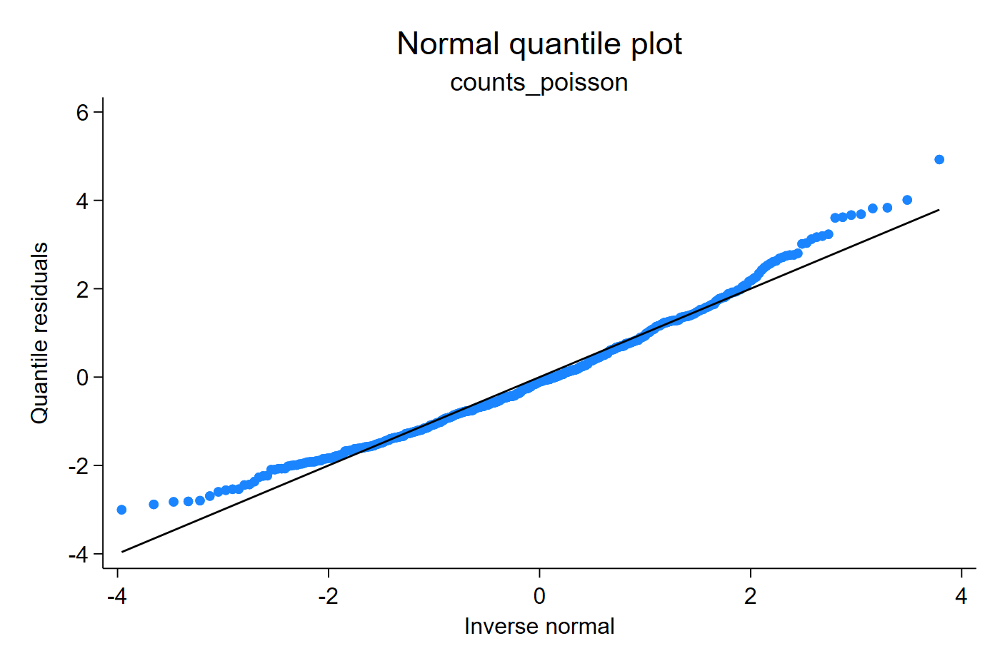
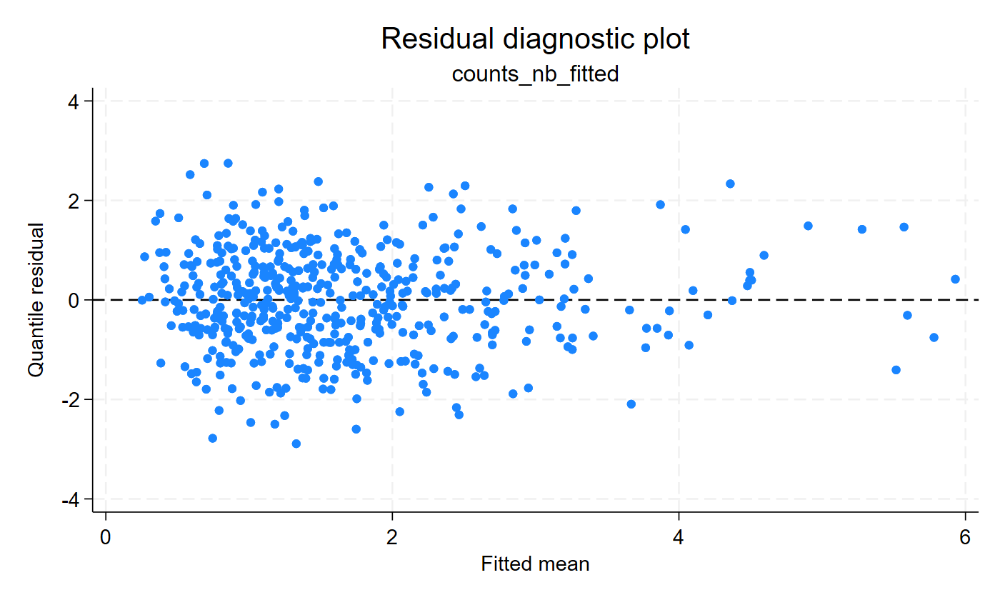
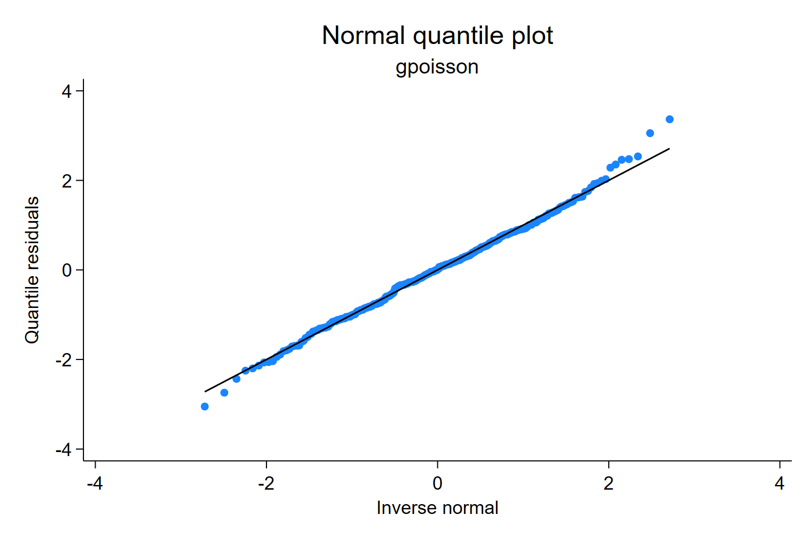
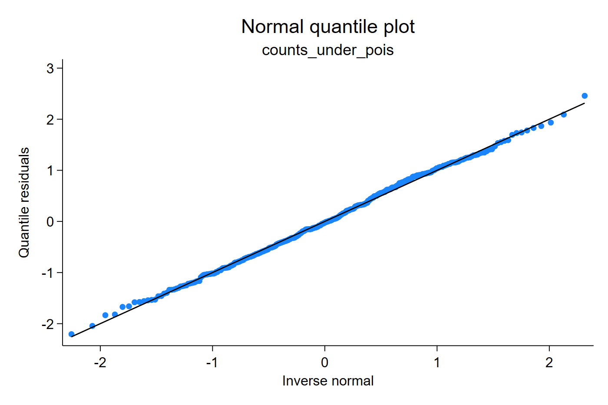
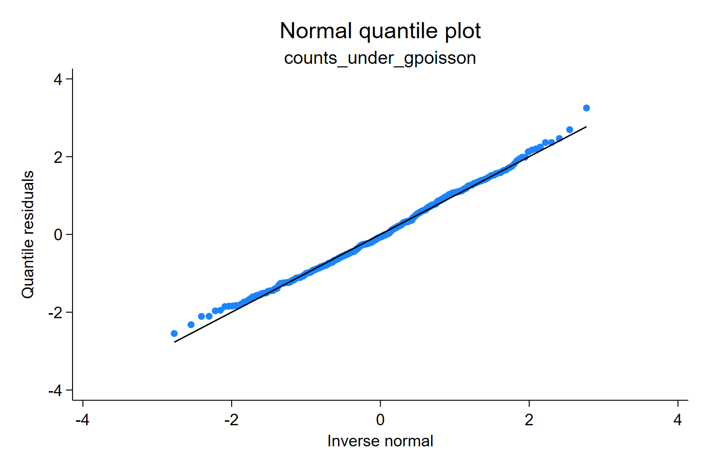

# Count outcomes

Count diagnostics often start with traditional summaries: compare the sample
mean with the variance, inspect Pearson or deviance dispersion, or compare
information criteria across fitted models. These are useful first checks, but
they are not specific diagnoses. Rejecting a Poisson model does not imply that
the negative-binomial model is automatically correct; the data may be
underdispersed, strongly overdispersed, zero-inflated, truncated, censored, or
misspecified through the link or covariates.

Quantile residuals add a graphical check of the whole fitted distribution. The
Q-Q plot shows whether the fitted CDF places the observed counts on an
approximately normal scale, while residual-versus-fitted or
residual-versus-covariate plots show where the fitted count distribution starts
to fail.

## Poisson versus negative binomial

This example starts the way many count-data analyses start: summarize the
outcome, fit a Poisson model, inspect goodness of fit, and compare information
criteria with a negative-binomial model. These outputs are useful because they
warn that the Poisson mean-variance restriction is too narrow, but they do not
by themselves show where the fitted count distribution fails.

```stata
summarize y
poisson y x
qresid rq_pois, uvar(v)
estat gof
estat ic

nbreg y x
qresid rq_nb, uvar(v)
estat ic
qnorm rq_nb
predict double fit_nb, n
scatter rq_nb fit_nb, yline(0)
```

[Stata output excerpt](assets/output/counts_poisson_nb_output.txt)

The Stata output gives the classical evidence: the variance is larger than the
mean, the Poisson goodness-of-fit statistic is unfavorable, and the
negative-binomial information criterion improves. The Q-Q plots translate that
same problem into a residual scale: if the Poisson CDF is too narrow, the
normal Q-Q plot bends away from the line, especially in the tails.




The Poisson fit shows tail departures because it forces the conditional
variance to equal the conditional mean. The negative-binomial fit adds an
ancillary dispersion parameter; the resulting Q-Q plot is much closer to the
reference line in this example.



Take-home message: dispersion summaries can tell you that Poisson is too
narrow, but the residual plots show how the misspecification appears across
the fitted distribution.

## Binomial counts

Binomial count data are not Poisson counts; they have a known upper bound set by
the number of trials. See the [binary and binomial tutorial](binary-binomial.md)
for an example using `glm, family(binomial trials)`.

## Generalized Poisson

The generalized-Poisson example illustrates a model whose residuals are
computed from an externally estimated count distribution. The important point
is not the command name, but the probability law: once the fitted mean and
dispersion parameter are available, `qresid` checks the corresponding fitted
CDF.

```stata
findit gpoisson
gpoisson y x, nolog
qresid rq_gpois, uvar(v)
qnorm rq_gpois
```

[Stata output excerpt](assets/output/gpoisson_output.txt)



The `gpoisson` example requires the documented Stata Journal estimator to be
installed or added to the adopath. The residual calculation uses the fitted
mean and generalized-Poisson dispersion parameter from that estimator.

## Underdispersed counts

Underdispersion is less common in applied health data than overdispersion, but
it can arise in bounded or tightly regulated count processes. A traditional
variance-to-mean check can say that the Poisson variance assumption is wrong;
it does not say whether the right alternative is negative binomial,
generalized Poisson, zero inflation, or a different mean structure.

```stata
summarize y
poisson y x
qresid rq_under_pois, uvar(v)
qnorm rq_under_pois

nbreg y x

gpoisson y x, nolog
qresid rq_under_gpois, uvar(v)
qnorm rq_under_gpois
```

[Stata output excerpt](assets/output/counts_underdispersed_output.txt)

Here the classical summaries reject the simple Poisson variance relationship,
but the direction matters. A negative-binomial model mainly expands the
variance and is therefore not designed to repair an underdispersed process.
In this simulated dataset, the negative-binomial ancillary parameter collapses
essentially to the Poisson boundary. The residual plots therefore focus on the
Poisson fit and the generalized-Poisson fit, where the latter can move its
dispersion parameter in the underdispersed direction.





In this simulated example, the Poisson model leaves visible tail compression,
and the negative-binomial model is not designed to repair underdispersion. The
generalized-Poisson fit has a dispersion parameter that can move in the
underdispersed direction, so its residuals align more closely with the normal
reference line.

Take-home message: for count outcomes, the main diagnostic problem is often
choosing the right probability law, not only detecting that a single statistic
is large or small.
