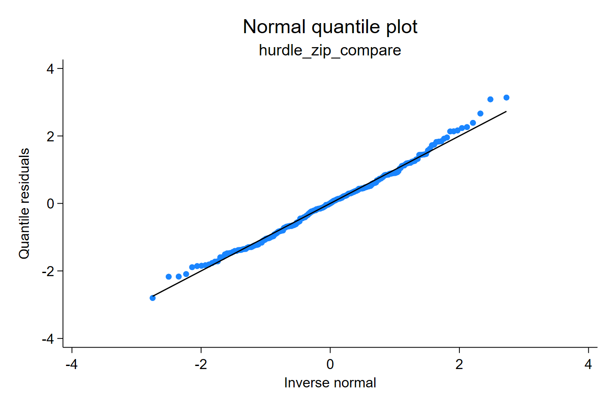

# Hurdle count models

Hurdle and zero-inflated models can both produce many zeros, but they represent
different data-generating mechanisms. A zero-inflated model mixes structural
zeros with a count distribution that can also generate zeros. A hurdle model
first models whether the outcome is zero, and then models the positive counts
with a zero-truncated distribution.

`qresid` supports the documented external Stata estimators `hplogit` and
`hnblogit` when they are installed separately. They are not bundled with
`qresid`.

## Comparing zero-inflated and hurdle fits

The example below compares a zero-inflated Poisson fit with a Poisson-logit
hurdle fit. Both models can increase the number of zeros, but they answer
different scientific questions. The zero-inflated model allows structural zeros
and sampling zeros from the count distribution. The hurdle model separates the
probability of any event from the positive count intensity once the hurdle is
crossed.

```stata
findit hplogit
findit hnblogit

zip y x, inflate(x)
qresid rq_zip_compare, uvar(v)

hplogit y x, nolog
qresid rq_hplogit, uvar(v)
qnorm rq_hplogit
```

[Stata output excerpt](assets/output/hurdle_output.txt)




The hurdle residual uses a CDF with a point mass at zero and a positive
zero-truncated count distribution above zero. In applied work, compare the
zero behavior and the positive-count tail separately; a model can fit one part
well and the other part poorly.

Take-home message: zero inflation and hurdle structure are not interchangeable
labels for "many zeros." The residual plot should be read together with the
scientific mechanism that generated the zeros.
