# Link and functional-form checks

Quantile residuals are distributional residuals, but the fitted distribution
depends on the mean function. A wrong link or a missing nonlinear term can
therefore appear as curvature, bands, or systematic drift in residual plots.
This page uses binary examples because they make the contrast with Pearson and
deviance residuals especially clear.

## Choosing among plausible links

This example uses binomial counts with only six possible observed values
\(0,1,\ldots,5\). That small support is common in applied work: the outcome is
more informative than a single Bernoulli trial, but it is still highly
discrete. The data are generated from a complementary log-log mean curve. We
first fit the reverse-asymmetry log-log link, then the complementary log-log
link. The question is
not whether the fitted coefficients look reasonable; it is whether the fitted
binomial CDF leaves a residual pattern over the covariate scale.

```stata
glm y x, family(binomial trials) link(loglog)
predict double pearson_link_loglog, pearson
predict double deviance_link_loglog, deviance
qresid rq_bin_loglog, uvar(v)
qnorm rq_bin_loglog

glm y x, family(binomial trials) link(cloglog)
qresid rq_bin_cloglog, uvar(v)
qnorm rq_bin_cloglog
scatter rq_bin_cloglog x, yline(0)
```

[Stata output excerpt](assets/output/binary_links_output.txt)

The classical residual plots below show the practical problem. Pearson and
deviance residuals split into parallel bands because the response can only
take a few values. Those bands are real, but they make it hard to decide
whether the link function is the main issue or whether the banding is simply a
property of the outcome scale.

| Pearson residuals under log-log | Deviance residuals under log-log |
|---|---|
| 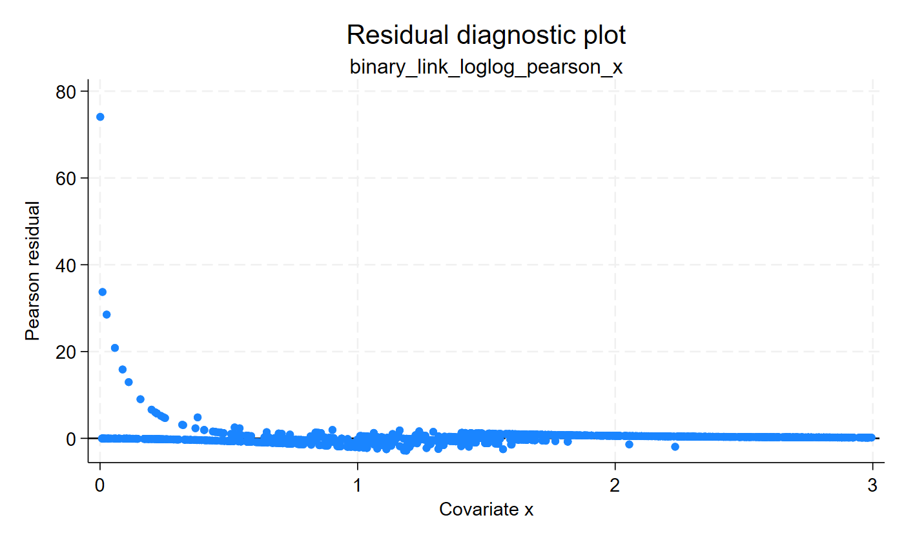 | 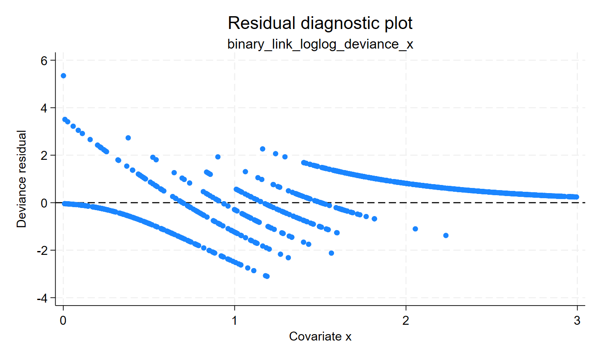 |

The quantile residuals evaluate the fitted binomial CDF and then move the
result to a normal scale. Under the log-log link, the Q-Q plot and
residual-versus-covariate plot expose tail and centering problems that are much
harder to read from the banded classical residuals. Under the complementary
log-log link, the cloud is more evenly centered and the Q-Q plot is closer to
the reference line.

| Log-log link | Complementary log-log link |
|---|---|
|  |  |
| 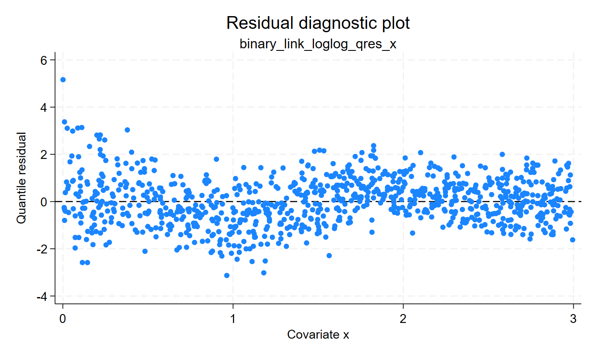 |  |

The Q-Q plot asks whether the fitted binomial CDF produces approximately
normal residuals. The residual-versus-covariate plot asks whether the fitted
probability curve still leaves structure over the predictor range. The same
data produced all four panels; the gain comes from putting the discrete
binomial information on a scale designed for graphical residual diagnosis.

Take-home message: with a small number of binomial response values,
Pearson/deviance residuals can show more of the outcome support than of the
link problem. Quantile residuals let link choice be inspected with the same
visual habits used after Gaussian regression, while still respecting the
binomial distribution.

## Detecting a missing nonlinear term

The second example uses a binary outcome generated from a U-shaped risk curve.
A linear logit model imposes a monotone change in risk, so it cannot represent
the low-risk middle and higher-risk extremes. Adding the quadratic term gives
the model enough structure to match the data-generating curve.

```stata
glm y x, family(binomial) link(logit)
predict double pearson_lin, pearson
predict double deviance_lin, deviance
qresid rq_logit_linear, uvar(v)

generate double x2 = x^2
glm y x x2, family(binomial) link(logit)
qresid rq_logit_quadratic, uvar(v)
```

[Stata output excerpt](assets/output/binary_nonlinearity_output.txt)


The Pearson and deviance plots are affected by the discrete response scale and
separate into bands. Even after improving the mean model, those scales remain
hard to read because the binary outcome dominates the picture. The quantile
residual plots are more transparent: the linear logit model leaves a visible
U-shaped pattern in the residual cloud, while the quadratic model makes the
cloud more symmetric around zero.

The same lesson appears in the Q-Q plots: the linear predictor without the
quadratic term leaves distributional departures, while the richer mean model
puts the fitted Bernoulli probabilities closer to the observed pattern.


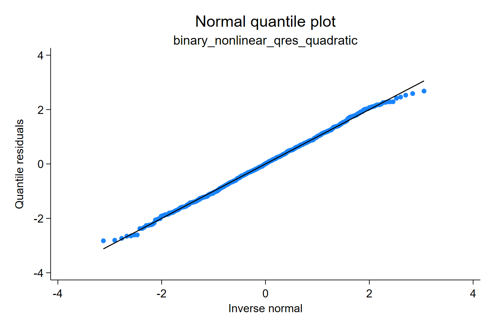

Take-home message: a residual is not only a tail diagnostic. Because the CDF is
conditional on the fitted mean, quantile residuals can also reveal link and
functional-form problems.

## Seasonal functional form

Many epidemiologic outcomes have seasonal structure: risk may rise during one
part of the year, fall, and rise again during another period. A simple linear
time trend is a poor representation of that mechanism because it assumes that
risk moves steadily in one direction across the year. This example simulates a
Bernoulli outcome with two smooth seasonal waves and compares a linear-time
logit model with a Fourier model using sine and cosine terms.

```stata
generate double s1 = sin(2*_pi*t)
generate double c1 = cos(2*_pi*t)
generate double s2 = sin(4*_pi*t)
generate double c2 = cos(4*_pi*t)

glm y t, family(binomial) link(logit)
predict double pearson_seasonal, pearson
predict double deviance_seasonal, deviance
qresid rq_seasonal_linear, uvar(v)
estat ic

glm y s1 c1 s2 c2, family(binomial) link(logit)
qresid rq_seasonal_fourier, uvar(v)
estat ic
```

[Stata output excerpt](assets/output/binary_seasonal_functional_form_output.txt)

The information criteria compare the fitted models globally, but they do not
show where the linear-time model is failing. The residual plots below focus on
the time scale. Pearson and deviance residuals still reflect the binary
support, so their direct scatterplots split into bands. The quantile residuals
put the same Bernoulli information on a normal scale and make the omitted
seasonal wave easier to see without treating the outcome as continuous.

| Classical residual scales | Quantile residual scale |
|---|---|
| 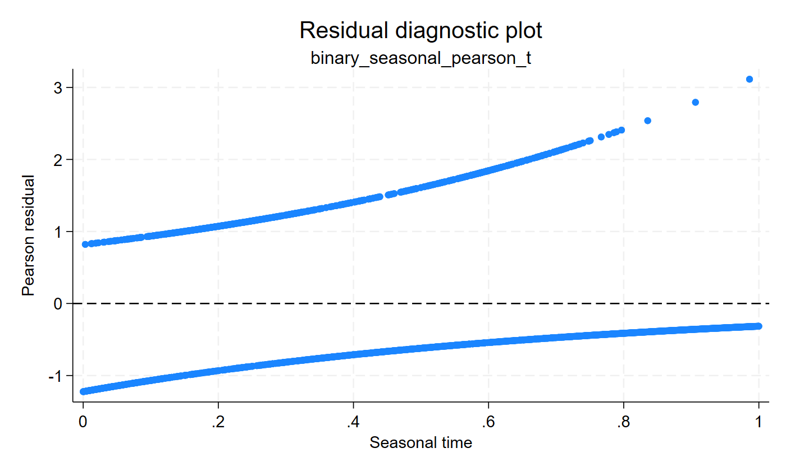 | 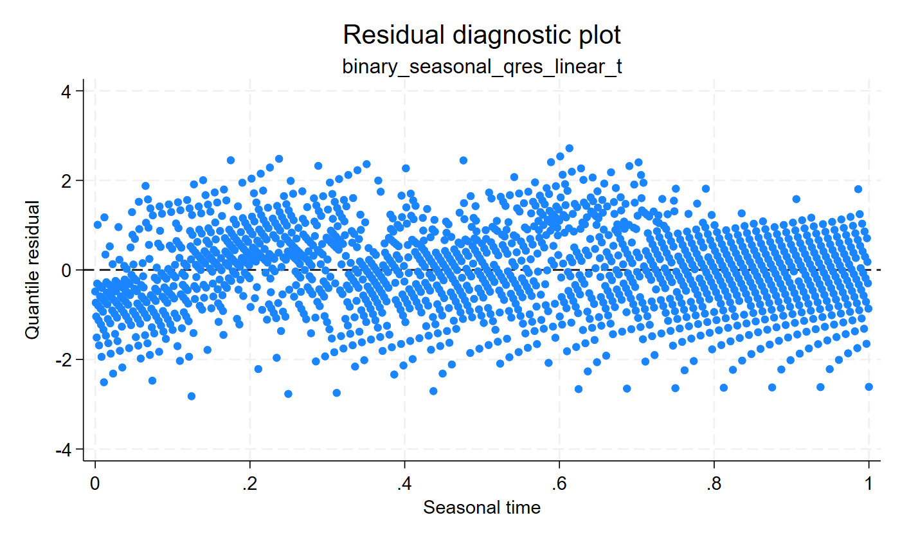 |
| 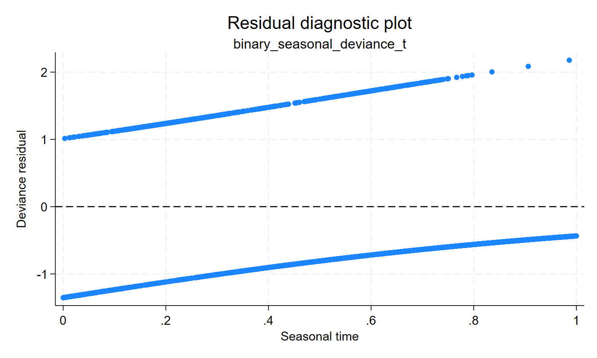 | 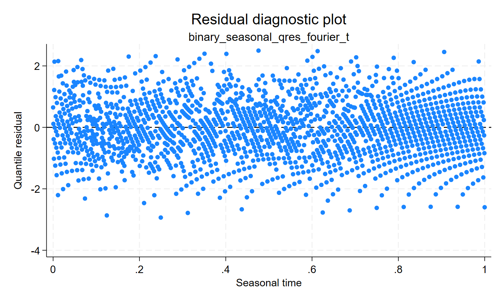 |

In the linear-time model, the quantile residual cloud has a seasonal imbalance:
early and middle-year bands do not sit around zero in the same way. After
adding the Fourier terms, the cloud is more evenly centered. The model has not
made the binary outcome continuous; it has supplied a better fitted Bernoulli
CDF for the same PIT-based residual.

### Optional smoothing as a reading aid

The panels above are the main diagnostic display. A smooth curve can be useful
as a reading aid, but it should not become a black box that replaces the
residual scale. With quantile residuals, the smooth is easier to interpret
because it summarizes residuals already placed on a common normal scale. In
the linear-time model, the smooth curve shows the seasonal drift; after the
Fourier terms, it is much flatter.

| Linear-time quantile residuals | Fourier quantile residuals |
|---|---|
| 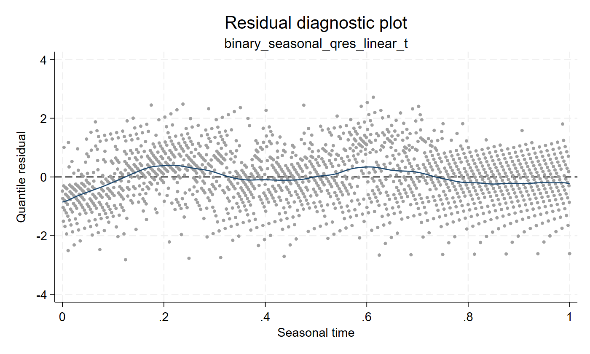 | 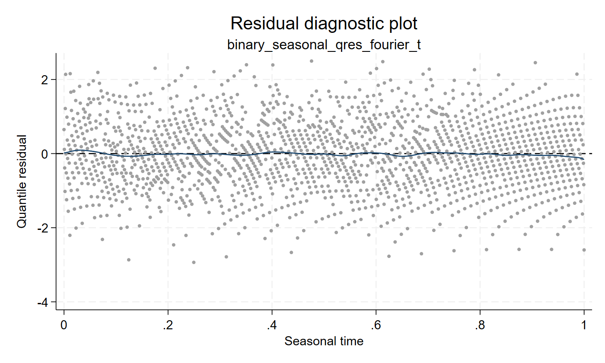 |

The Q-Q plots provide the complementary distributional check. The Fourier
model reduces the systematic departure created by the missing seasonal mean
structure.

| Linear-time model | Fourier model |
|---|---|
| 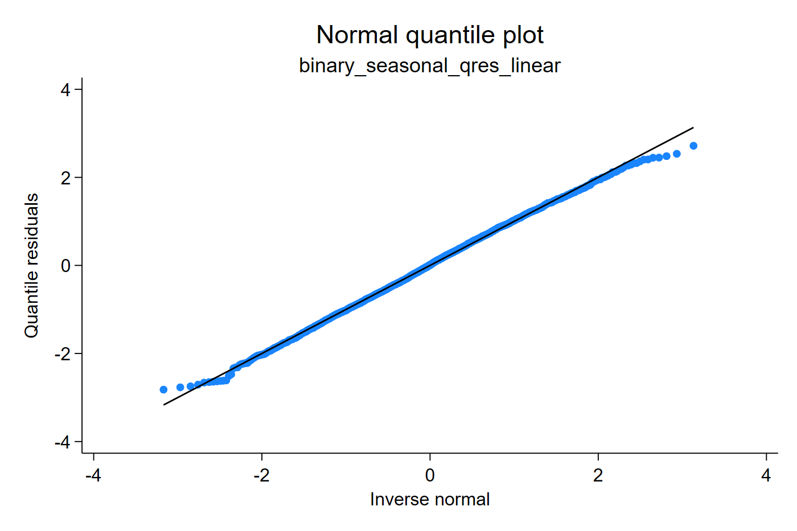 | 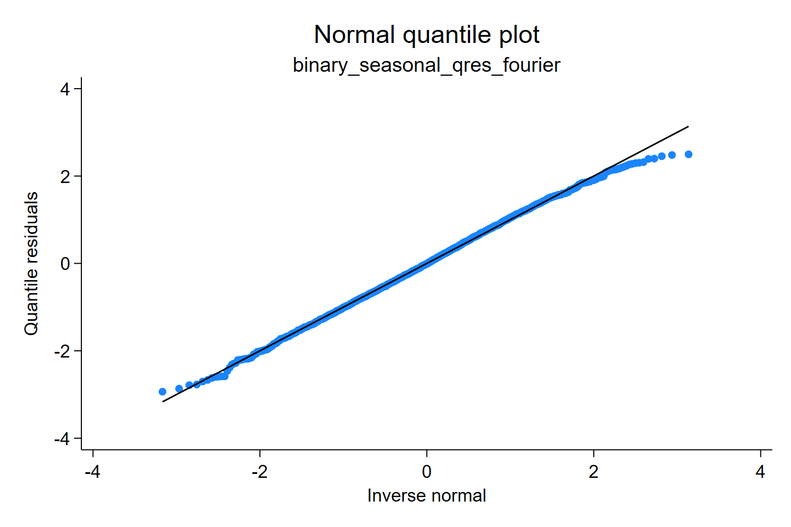 |

Take-home message: quantile residuals can reveal a subtle seasonal functional
form in binary data using the same residual-versus-covariate logic familiar
from linear regression, but the residual itself remains tied to the fitted
Bernoulli distribution.
