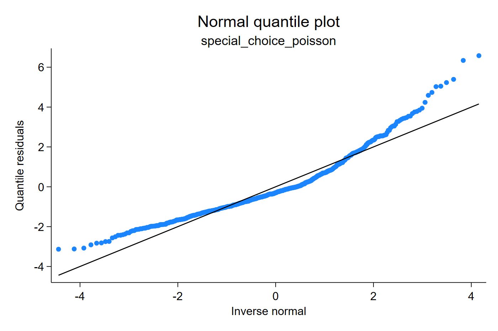
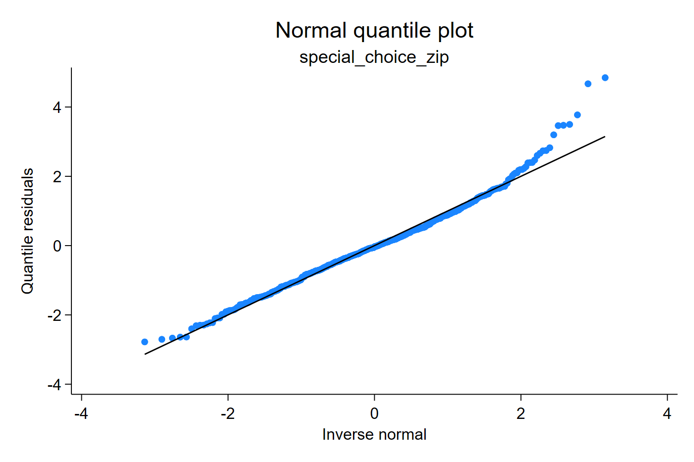
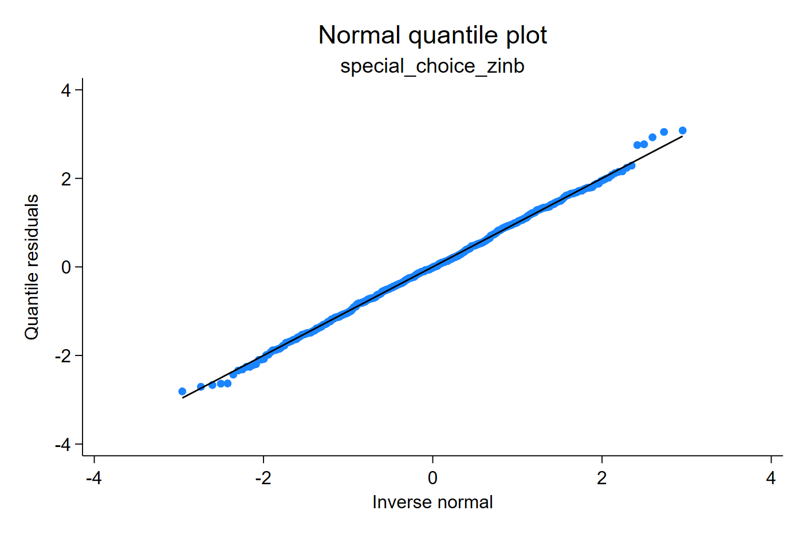
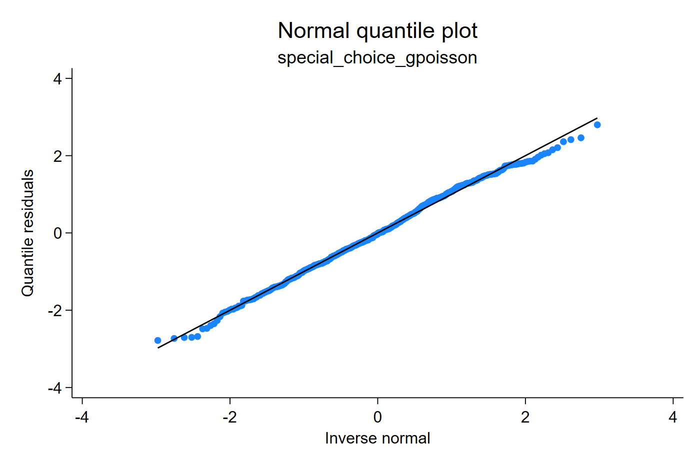
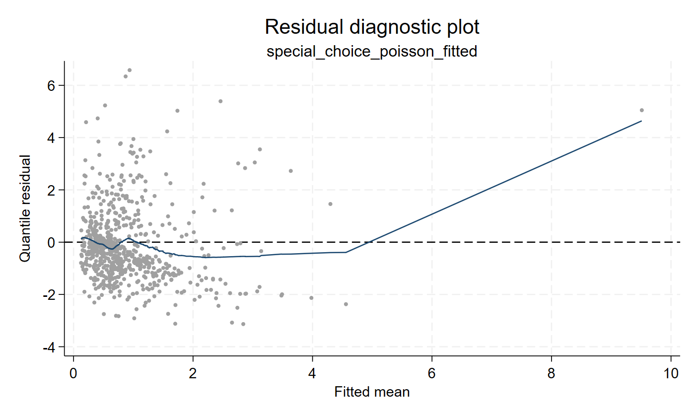
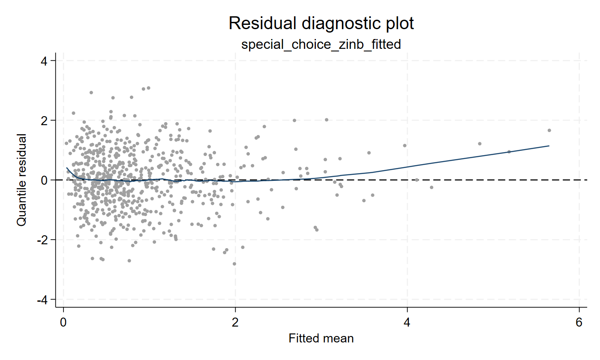
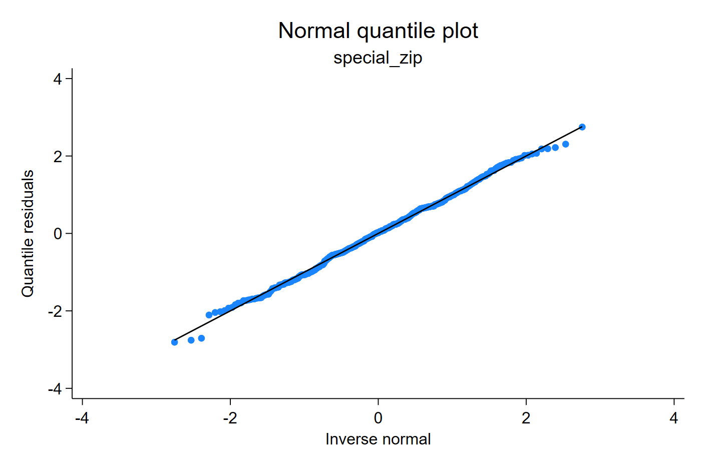
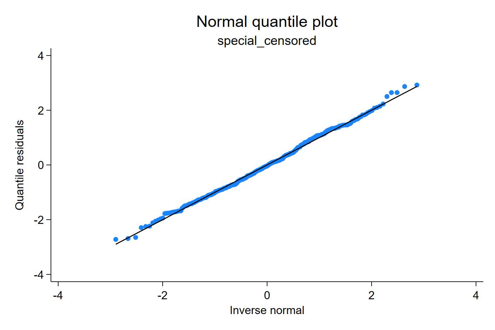

# Zero-inflated, truncated, and censored counts

These models change the fitted CDF in different ways. Zero-inflated models add
extra probability at zero. Truncated models condition on observing values
inside the allowed support. Censored models observe intervals rather than exact
values for censored observations.

Traditional goodness-of-fit statistics are useful, but they usually answer a
coarse question. A Poisson model can be rejected because the variance is too
large, because there are too many zeros, because the support is truncated, or
because the count component has the wrong tail. Quantile residuals help make
that distinction visible by checking the fitted CDF itself.

## Model choice beyond "not Poisson"

This simulated example deliberately combines two common problems: extra zeros
and a dispersed count component. A classical workflow can reject Poisson and
rank candidate models with information criteria, but the rejection itself is
not specific. The data might require a negative-binomial tail, a
generalized-Poisson dispersion parameter, a zero-inflation process, or some
combination of these.

```stata
summarize y

poisson y x
qresid rq_mc_pois, uvar(v)
estat gof
estat ic

nbreg y x
qresid rq_mc_nb, uvar(v)
estat ic

gpoisson y x, nolog
qresid rq_mc_gp, uvar(v)

zip y x, inflate(z)
qresid rq_mc_zip, uvar(v)
estat ic

zinb y x, inflate(z)
qresid rq_mc_zinb, uvar(v)
estat ic
```

[Stata output excerpt](assets/output/special_model_choice_output.txt)

The Stata output is useful because it records the fitted models and the usual
summary comparisons. The residual plots below add the distributional view: they
show how each fitted CDF maps the same observed counts onto the normal scale.

| Model with poorer CDF fit | Flexible alternatives |
|---|---|
|  |  |
|  |  |



The Poisson and zero-inflated Poisson fits leave strong tail departures because
they do not fully capture the count-component variability. The negative
binomial and generalized Poisson fits handle overdispersion better, and the
zero-inflated negative-binomial model aligns best in this example because the
data-generating process includes both extra zeros and a dispersed count
component.

The residual-versus-fitted plots show the same idea from another angle. Before
looking at the panels, ask whether the smooth curve remains close to zero over
the fitted mean range. Poisson leaves systematic structure, while the
zero-inflated negative-binomial fit leaves a flatter residual pattern.

| Poisson fitted CDF | Zero-inflated negative-binomial fitted CDF |
|---|---|
|  |  |

Take-home message: a global statistic can say "Poisson is inadequate"; a
distributional residual plot helps ask which alternative distribution is more
credible.

## Zero-inflated counts

Zero-inflated residuals combine two pieces of the fitted distribution: the
structural-zero probability and the ordinary count CDF. A good plot therefore
supports both parts of the model, not only the total number of zeros.

```stata
zip y_zip x, inflate(z)
qresid rq_zip, uvar(v)
qnorm rq_zip
```

[Stata output excerpt](assets/output/special_counts_output.txt)



The zero-inflated CDF combines the structural-zero probability with the count
distribution. A good residual plot therefore checks both the zero process and
the count component.

## Truncated counts

Truncation changes the support. A zero-truncated model should not be judged
against a CDF that assigns probability to unobserved impossible zeros.

```stata
tpoisson y_trunc x, ll(0)
qresid rq_tpois, uvar(v)
qnorm rq_tpois
```


For a zero-truncated count model, the CDF is the ordinary count CDF normalized
over the positive support. Values that would have been impossible under the
sampling design are not part of the residual distribution.

## Censored counts

Censoring changes what is observed. Instead of an exact count, a censored row
corresponds to an interval of possible values, and the PIT is randomized inside
the fitted probability assigned to that interval.

```stata
cpoisson y_cens x, ll(1) ul(8)
qresid rq_cpois, uvar(v)
qnorm rq_cpois
```



For censored counts, the PIT interval corresponds to the probability mass in
the observed censoring interval. This is why the residual can still be placed on
the normal quantile scale even when the exact count is not observed.
