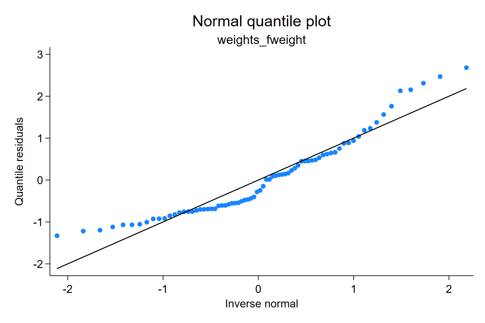
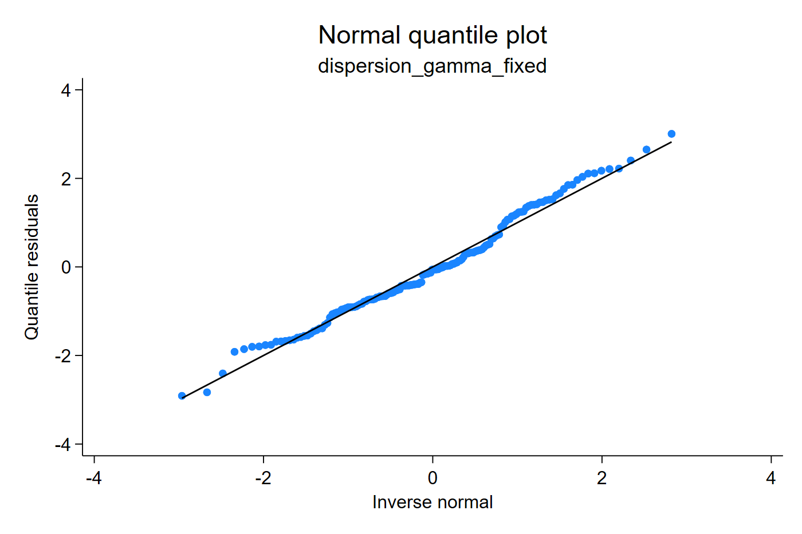

# Frequency weights and dispersion replay

Weights and dispersion parameters affect the fitted conditional distribution.
For frequency weights, the weight represents repeated observations in the
estimation problem. `qresid` evaluates the fitted CDF for each row; the final
normal-score residual is not multiplied by the weight.

## Frequency weights

This example treats frequency weights as repeated observations in the fitted
model. The fitted coefficients and fitted CDF can change because some rows
represent more observations, but the final residual is still interpreted on the
normal quantile scale for each displayed row.

```stata
sysuse auto, clear
generate int fw = cond(_n <= 20, 2, 1)
regress price mpg weight [fweight=fw]
qresid rq_fw
qnorm rq_fw
```

[Stata output excerpt](assets/output/weights_dispersion_output.txt)



The diagnostic is interpreted on the same normal scale as the unweighted
residual. The weight changes the fitted model and therefore the fitted CDF.

## Gamma dispersion replay

For Gamma and inverse-Gaussian GLMs, the dispersion parameter affects the
conditional distribution around the fitted mean. This example keeps the fitted
mean fixed and changes the dispersion used in the CDF calculation. It is a CDF
replay or sensitivity calculation, not a refit.

```stata
glm y x, family(gamma) link(log)
qresid rq_gamma_default
qresid rq_gamma_phi, dispersion(.35)
qnorm rq_gamma_phi
```

[Stata output excerpt](assets/output/dispersion_output.txt)



`dispersion(#)` does not refit the model. It recomputes the fitted Gamma or
inverse-Gaussian CDF using the same fitted mean and the user-supplied positive
dispersion. This is useful for sensitivity checks and for reproducing a CDF
calculation with a fixed dispersion value.

## Direct probability weights

Direct `[pweight=]` support is a model-based diagnostic for selected Gaussian,
Poisson, and Bernoulli specifications. It is not `svy:` support and should not
be interpreted as a survey-design residual.
